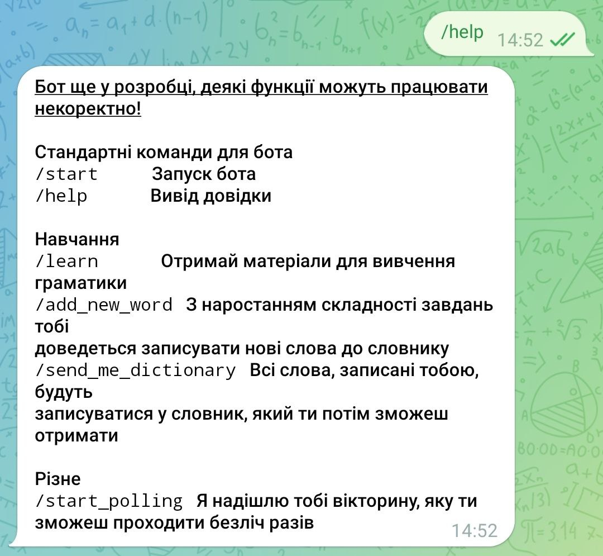
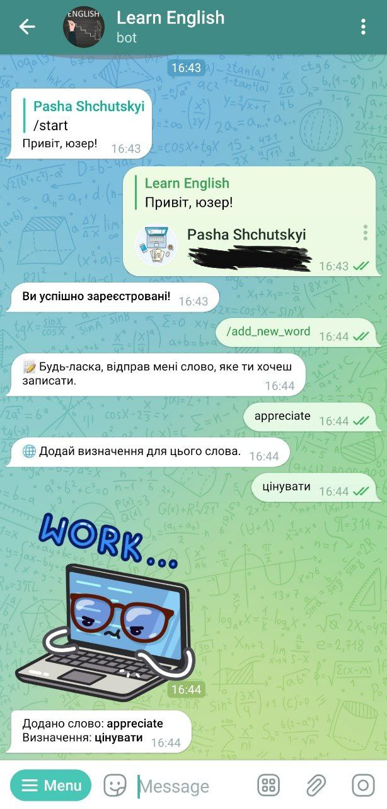
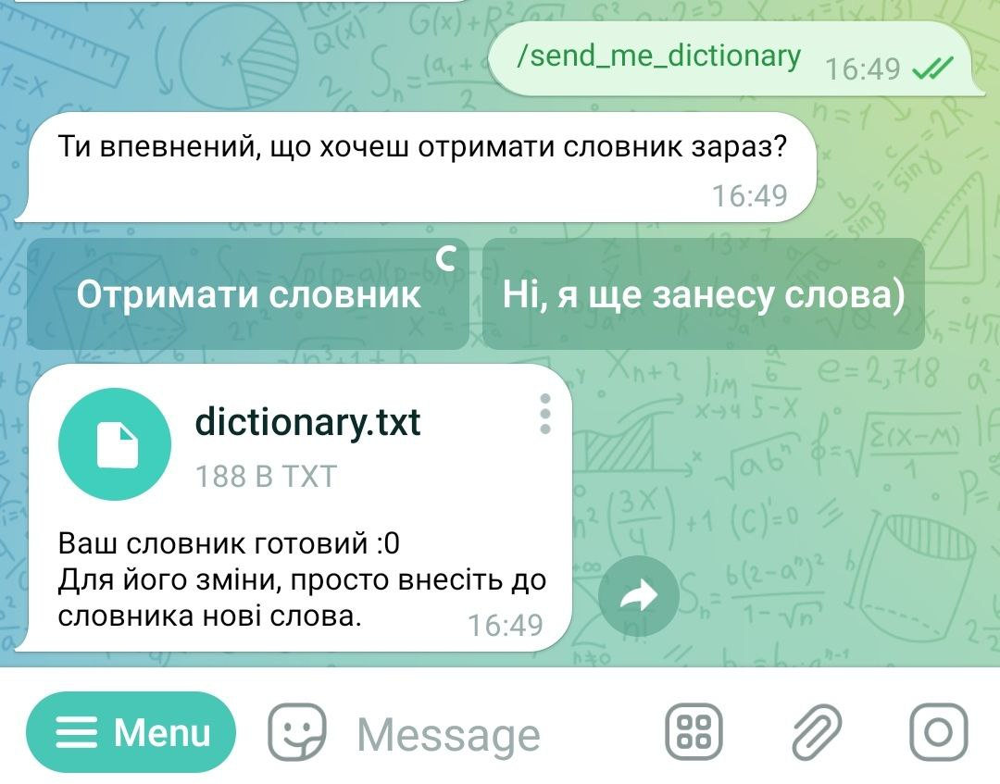

# Learn English with this bot

### This bot was created to help people learn english. But some functions are unavailable if user didn't sign up.

## ***What this bot can do?***
>1) Bot sends links with materials to learn grammar.
>2) Users can keep their dictionary.
>3) Admins can add quiz questions for users.

## Usage
#### - At the beginning there is a description with picture (which is available on phones only)
  

#### - You can use ```/help``` command to display reference


#### - The ```/start``` command will ask user to sign up, if this user didn't use this bot before.
  - __Some functionality would be unavailable if user didn't complete the registration__

Beginning of registration | Successfull user registration
:-------------------------:|:-----------------------------:
 | 


#### - One very useful function is that user can add to his dictionary new words and definition to them very fast, efficiently and in an easy way get them with ```/add_new_word``` and ```/send_me_dictionary``` commands

Writing a word in user dictionary | Getting dictionary from bot
:-------------------------:|:-----------------------------:
 | 

#### - The ```/learn``` command will say bot to send you a ton of links about grammar


### TODO:
- [ ] Add english version of bot
- [x] Fix some bugs with unsigned user
